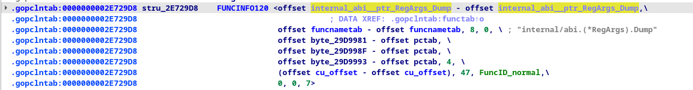

# gopclntabParser
A simple but useful gopclntab segment function parser :)

# gopclntab 解析
支持版本1.20+, 如果需要其他版本可以自行查看golang源码来修改其中字段，欢迎大家PR :)
由于部分golang编译的elf文件去除掉符号表，因此无法使用正常的符号解析方法来获取符号地址
而go语言编译的文件除了symtab还需要名为`.gopclntab`的段来存放符号信息， 因此可以通过手动解析该段来达成目标

符号表的格式可以从[官方github](https://github.com/golang/go/blob/go1.20.6/src/runtime/symtab.go#L414)上获取

```go
 // pcHeader holds data used by the pclntab lookups.
type pcHeader struct {
	magic          uint32  // 0xFFFFFFF1
	pad1, pad2     uint8   // 0,0
	minLC          uint8   // min instruction size
	ptrSize        uint8   // size of a ptr in bytes
	nfunc          int     // number of functions in the module
	nfiles         uint    // number of entries in the file tab
	textStart      uintptr // base for function entry PC offsets in this module, equal to moduledata.text
	funcnameOffset uintptr // offset to the funcnametab variable from pcHeader
	cuOffset       uintptr // offset to the cutab variable from pcHeader
	filetabOffset  uintptr // offset to the filetab variable from pcHeader
	pctabOffset    uintptr // offset to the pctab variable from pcHeader
	pclnOffset     uintptr // offset to the pclntab variable from pcHeader
}
 ``` 


在`go/src/runtime/syntab.go`里面也可以得到一些其他的结构体
functab
```go
type functab struct {
	entryoff uint32 // relative to runtime.text
	funcoff  uint32
}
```

functab 的entryoff 是指对应函数在整体代码段的偏移地址
funcoff 则是指与pclntab对应函数描述结构体的偏移，描述结构体从ida上面看出来存在funcnametab的偏移:
 
module
```go
type moduledata struct {
	pcHeader     *pcHeader
	funcnametab  []byte
	cutab        []uint32
	filetab      []byte
	pctab        []byte
	pclntable    []byte
	ftab         []functab
	findfunctab  uintptr
	minpc, maxpc uintptr

	text, etext           uintptr
	noptrdata, enoptrdata uintptr
	data, edata           uintptr
	bss, ebss             uintptr
	noptrbss, enoptrbss   uintptr
	covctrs, ecovctrs     uintptr
	end, gcdata, gcbss    uintptr
	types, etypes         uintptr
	rodata                uintptr
	gofunc                uintptr // go.func.*

	textsectmap []textsect
	typelinks   []int32 // offsets from types
	itablinks   []*itab

	ptab []ptabEntry

	pluginpath string
	pkghashes  []modulehash

	modulename   string
	modulehashes []modulehash

	hasmain uint8 // 1 if module contains the main function, 0 otherwise

	gcdatamask, gcbssmask bitvector

	typemap map[typeOff]*_type // offset to *_rtype in previous module

	bad bool // module failed to load and should be ignored

	next *moduledata
}
```

由于本项目由c编写，所以需要对上述结构体进行一个本土化,这里的部分来自于[https://github.com/open-telemetry/opentelemetry-ebpf-profiler/blob/main/doc/gopclntab.md](https://github.com/open-telemetry/opentelemetry-ebpf-profiler/blob/main/doc/gopclntab.md)


通过阅读go官方源码以及ida分析一个简单的goelf可以得知，在elf里面gopclntab段的排列如下

                             pclnOffset                                nameOff
                        ┌──────────────────────┐                  ┌──────────────┐
                        │                      ▼                  │              ▼
                ┌───────┴──┬───────────────┬─────────┬────┬───────┴────┬────┬───────────┬──────┐
                │ pcHeader │               │ functabs│    │  __func    │    │funcnametab│      │
                └──────────┴───────────────┼─────────┼────┴────────────┴────┴───────────┴──────┘
                                           │         │         ▲
                                           │         │         │
                                           │         │         │
                                           │         │         │
                                ┌──────────┘         └───┐     │
                                ▼                        ▼     │
                           ┌───────┬───────┬───────┬───────┐   │
                           │functab│functab│functab│...    │   │
                           └────┬──┴───────┴───────┴───────┘   │
                                └──────────────────────────────┘
                                       funcoff


# 使用
只需要有gcc即可
```sh
> make
> ./elfChecker -h
Usage: ./elfChecker [OPTIONS]
Options:
	-f, --file FILENAME	Specify the input file
	-v, --verbose      	Enable verbose output
	-n, --funcname     	Specify the searched funcname
	-h, --help         	Display this help message
```


# 参考
[https://github.com/golang/go/blob/go1.20.6/src/runtime/symtab.go#L414](https://github.com/golang/go/blob/go1.20.6/src/runtime/symtab.go#L414) 
[https://github.com/open-telemetry/opentelemetry-ebpf-profiler/blob/main/doc/gopclntab.md](https://github.com/open-telemetry/opentelemetry-ebpf-profiler/blob/main/doc/gopclntab.md)

